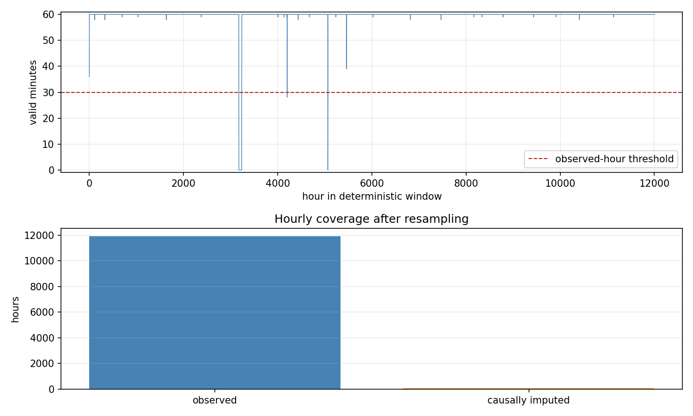
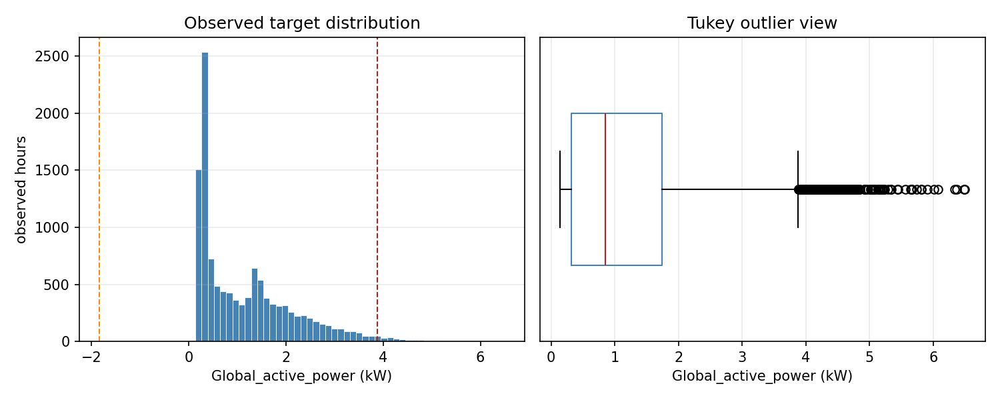
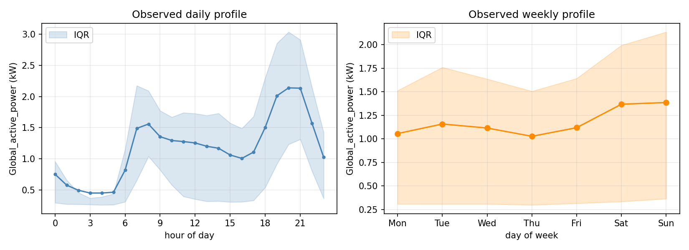
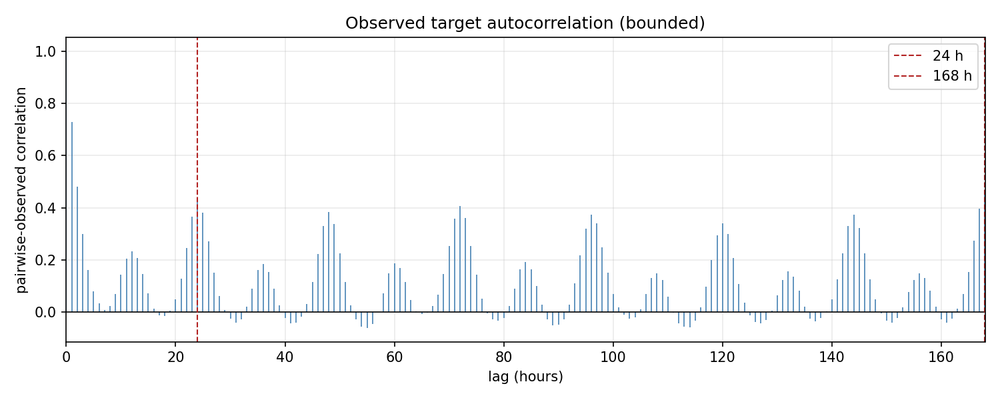
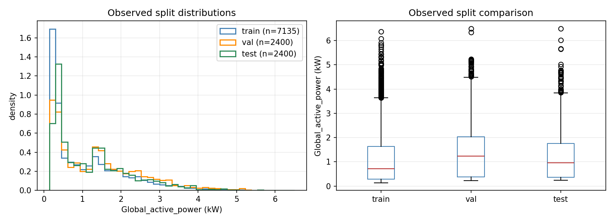

# JMLC 2026 Dataset EDA

All target statistics in this report use observed hourly targets only.
Causally imputed hours are reported as missingness and excluded from distributional claims.

## Dataset and deterministic window

- Dataset: UCI Individual Household Electric Power Consumption
- Target: `Global_active_power` (kilowatts)
- Raw SHA-256: `4259c9d7ece5dbee9ab8d53682baac68d791c864f0f64a52b4043cb3b90894b7`
- Source grid: 2006-12-16T17 — 2010-11-26T21
- Selected window: 2006-12-16T17 — 2008-04-29T16 (12000 hours)
- Exact duplicates removed: 0

## Missingness

| Scope | Missing | Total | Fraction |
| --- | ---: | ---: | ---: |
| Source-present minute rows with `?` | 25979 | 2075259 | 0.012518 |
| Selected-window absent or invalid minute slots | 3964 | 720000 | 0.005506 |
| Hours below the 30-valid-minute threshold | 65 | 12000 | 0.005417 |

The source-present `?` rate and the selected-window absent-or-invalid minute-slot rate have different denominators and are not interchangeable.

## Observed target distribution and outliers

- Observed hours: 11935
- Mean: 1.174546 kW
- Median: 0.855867 kW
- Sample standard deviation: 1.013270 kW
- Range: 0.138733 — 6.496033 kW
- Tukey 1.5 IQR outliers: 223 (0.018685)

## Daily and weekly profiles

Profiles are grouped by calendar hour and weekday using observed hours only; the shaded band is the interquartile range.

## Bounded autocorrelation

ACF uses pairwise-observed Pearson correlations for lags 0–168 hours. Each lag records its own valid-pair count in the JSON summary.

## Chronological split comparison

| Split | Range | Hours | Observed | Imputed | Mean (kW) |
| --- | --- | ---: | ---: | ---: | ---: |
| train | 2006-12-16T17 — 2007-10-12T16 | 7200 | 7135 | 65 | 1.088046 |
| val | 2007-10-12T17 — 2008-01-20T16 | 2400 | 2400 | 0 | 1.384558 |
| test | 2008-01-20T17 — 2008-04-29T16 | 2400 | 2400 | 0 | 1.221690 |

## Leakage and invariant checks

- Overall status: **PASS**
- `regular_hourly_axis`: PASS
- `first_hour_observed`: PASS
- `causal_forward_fill`: PASS
- `observed_imputed_masks_complementary`: PASS
- `chronological_disjoint_60_20_20`: PASS
- `source_grid_accounting`: PASS
- `observed_only_statistics`: PASS
- Horizon 1: PASS (exact alignment and no pair crosses a split boundary)
- Horizon 24: PASS (exact alignment and no pair crosses a split boundary)
- Random shuffle: not used
- Scaler: not fitted by EDA
- Statistical scope: observed targets only

Machine-readable details: [`aggregates/eda_summary.json`](aggregates/eda_summary.json).
